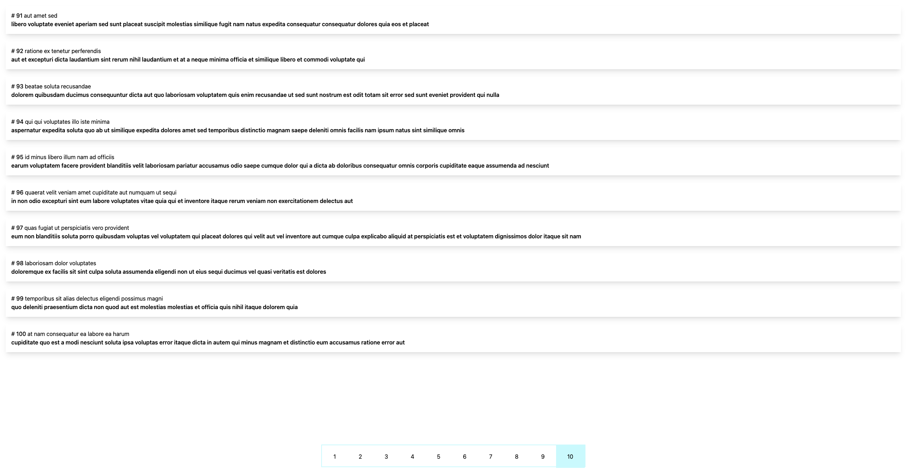

# Pagination Tutorial

## React + Next.js 13 + Tailwind CSS

This project was created to show how to perform pagination ourselves in Next.js

A very simple and easy project, designed to show the simplicity of producing pagination yourself and managing the information correctly between the components using next.js and react
## How to use

```bash
npm i
```
## How to run

```bash
npm run dev
```

# App example

# Desktop



